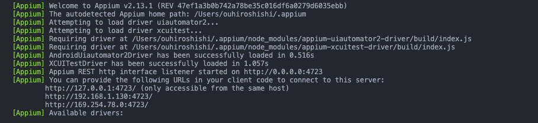
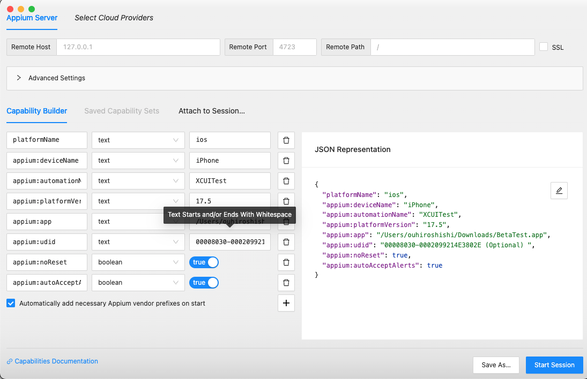
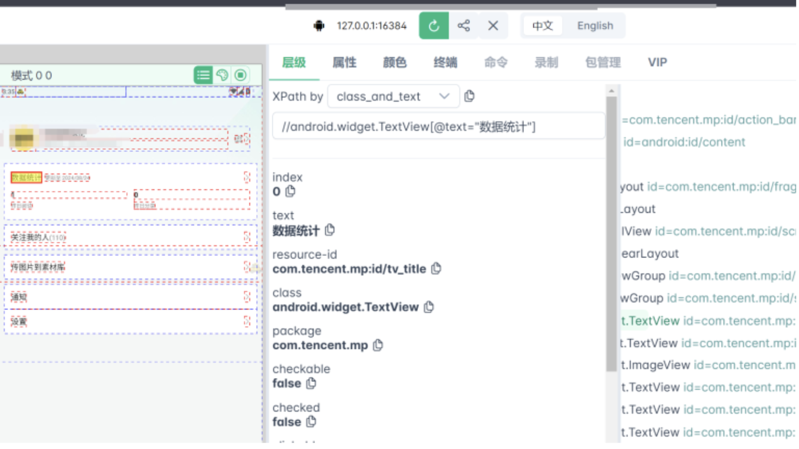

<div align="center">

# 🚀 Swift Appium Testing Framework

A powerful automated testing framework for Swift applications, supporting iOS platform.

[]()
[]()
[]()
[]()

[English](README.md) | [中文](README_zh.md)

</div>

## 📊 Project Overview

This framework provides comprehensive automated testing for Swift applications with detailed reporting and CI/CD integration.

### 🧪 Latest Test Reports

- **[iOS E2E Test Reports](https://ios-e2e-automation-demo.netlify.app)** - View latest iOS automated test results
- **[padOS E2E Test Reports](https://pados-e2e-automation-demo.netlify.app)** - View latest padOS automated test results

### 🚀 Key Features

- **Cross-Platform Support**: iOS and padOS testing capabilities
- **Automated CI/CD**: GitHub Actions integration with scheduled and manual triggers
- **Comprehensive Reporting**: Allure reports with detailed test insights
- **Real Device Testing**: BrowserStack integration for real device testing
- **Element Inspection**: Multiple tools for element location and inspection

# 📋 Table of Contents

- [🚀 Swift Appium Testing Framework](#-swift-appium-testing-framework)
  - [📊 Project Overview](#-project-overview)
    - [🧪 Latest Test Reports](#-latest-test-reports)
    - [🚀 Key Features](#-key-features)
- [📋 Table of Contents](#-table-of-contents)
  - [Required Software](#required-software)
  - [Package Installation](#package-installation)
  - [Appium Setup](#appium-setup)
  - [WebDriverAgent Setup (iOS Only)](#3-webdriveragent-setup-ios-only)
  - [Running Tests](#running-tests)
    - [Start Appium Server](#start-appium-server)
    - [Basic Test Execution](#basic-test-execution)
    - [Report Generation Commands](#report-generation-commands)
    - [Generate Test Reports](#generate-test-reports)
    - [📊 Live Test Reports](#-live-test-reports)
    - [Appium Inspector](#appium-inspector)
      - [iOS {Simulator} Configuration](#ios-simulator-configuration)
      - [iOS {Real Device} Configuration](#ios-real-device-configuration)
    - [Using Appium Inspector](#using-appium-inspector)
    - [uiauto.dev Tool](#uiautodev-tool)
      - [Prerequisites](#prerequisites)
      - [Installation](#installation)
      - [Launch Methods](#launch-methods)
      - [Key Features](#key-features)
      - [Configuration Steps](#configuration-steps)
      - [Using uiauto.dev](#using-uiautodev)
    - [Find Device UDID](#find-device-udid)

<h1 id="system-requirements">💻 System Requirements</h1>

### Required Software

| Software | Version    | Purpose             |
| -------- | ---------- | ------------------- |
| Xcode    | 15.4+      | iOS Testing         |
| Node.js  | Latest LTS | Runtime Environment |
| Python   | 3.x        | Test Scripts        |

### Package Installation

<h1 id="installation-guide">🔧 Installation Guide</h1>

### Appium Setup

```bash
# Install Appium globally
npm install -g appium

# Install iOS driver
appium driver install xcuitest
```

<h1 id="environment-setup">⚙️ Environment Setup</h1>

1. **Create Virtual Environment**

```bash
# Create virtual environment
python3 -m venv venv

# Activate virtual environment
# On macOS/Linux:
source venv/bin/activate

# On Windows:
# venv\Scripts\activate
```

2. **Install Dependencies**

```bash
# Install dependencies in virtual environment
pip install -r requirements.txt
```

3. **Configure Environment Variables**

```bash
# .env
APPIUM_OS="ios"
IMPLICIT_WAIT=15
NO_RESET="True"
AUTO_ACCEPT_ALERTS="True"
IOS_APP_PATH="/path/to/your/Beta.app"
#UDID="4BEC1422-4429-4EAD-B850-C296B013A210" #Optional
```

**Note:** Always activate the virtual environment before running tests:

```bash
source venv/bin/activate  # macOS/Linux
# venv\Scripts\activate   # Windows
```

### WebDriverAgent Setup (iOS Only)

1. Clone [WebDriverAgent](https://github.com/appium/WebDriverAgent)
2. Open WebDriverAgent.xcodeproj in Xcode
3. Select WebDriverAgentRunner and run tests

## Running Tests

1. **Platform-Specific Setup**

<details>
<summary>iOS Setup</summary>

1. Clone WebDriverAgent:

```bash
git clone https://github.com/appium/WebDriverAgent
```

2. Open WebDriverAgent.xcodeproj in Xcode
3. Select WebDriverAgentRunner and run tests
</details>

<h1 id="running-tests">🧨 Running Tests</h1>

### Start Appium Server

```bash
# Local start
appium
```

After starting Appium, you should see something like this:



<h1 id="test-execution-commands">⌨️ Test Execution Commands</h1>

### Basic Test Execution

```bash
# Run all tests with verbose output
pytest -v

# Run tests with regression marker
pytest -k "regression"

# Run tests by keyword
pytest -k "login_invalid_email"

# Run specific test file
pytest tests/steps/ios/test_01_ios_onboarding_steps.py
```

### Report Generation Commands

```bash
# Run tests with Allure report generation (Basic)
pytest --alluredir=./allure-results

# Run all tests including skipped tests with Allure report
pytest -v --alluredir=./allure-results

# Generate and open Allure report
allure serve ./allure-results
```

<h1 id="test-execution-reports">📊 Test Execution & Reports</h1>

```bash
# Run all tests and generate Allure report （Primary use）
# It will automatically generate allure report after test execution then send result to slack channel
pytest --alluredir=./allure-results

# Rerun failed tests （Secondary use）
pytest --lf --alluredir=./allure-results --reruns 3
```

### Generate Test Reports

```bash
# Generate static report （Primary use）
allure generate allure-results -o allure-report --clean

# Start report server （Secondary use）
allure serve allure-results
```

### 📊 Live Test Reports

View the latest automated test results from our CI/CD pipeline:

- **[iOS E2E Test Reports](https://ios-e2e-automation-demo.netlify.app)** - Latest iOS test results with detailed insights
- **[padOS E2E Test Reports](https://pados-e2e-automation-demo.netlify.app)** - Latest padOS test results with detailed insights

These reports are automatically generated and deployed after each test run, providing:

- **Test Statistics**: Pass/fail rates and execution times
- **Detailed Insights**: Test execution analysis and trends
- **Screenshots**: Visual evidence of test execution
- **Error Details**: Comprehensive failure analysis

<h1 id="element-location-tools">🔍 Element Location Tools</h1>

### Appium Inspector

- Download Appium Inspector
- Configure Appium Server
- Start Appium Server
- Launch Appium Inspector
- Configure Desired Capabilities

#### iOS {Simulator} Configuration

```json
{
  "platformName": "ios",
  "appium:deviceName": "iPhone 15",
  "appium:automationName": "XCUITest",
  "appium:platformVersion": "17.2",
  "appium:app": "/path/to/your/ios/AppName.app",
  "appium:noReset": true,
  "appium:autoAcceptAlerts": true
}
```

#### iOS {Real Device} Configuration

```json
{
  "platformName": "ios",
  "appium:deviceName": "iPhone",
  "appium:automationName": "XCUITest",
  "appium:platformVersion": "17.5",
  "appium:udid": "YOUR-PERSONAL-UUID",
  "appium:noReset": true,
  "appium:autoAcceptAlerts": true
}
```

### Using Appium Inspector

<div align="center">
  
</div>

### uiauto.dev Tool

[uiauto.dev](https://uiauto.dev/) is a powerful web-based tool for inspecting mobile app elements. It provides a more user-friendly interface compared to Appium Inspector and supports iOS platform.

#### Prerequisites

- Python 3.8 or higher
- Appium server running locally

#### Installation

```bash
# Install uiauto.dev
pip3 install -U uiautodev
```

#### Launch Methods

```bash
# Method 1: Direct command
uiauto.dev

# Method 2: Python module
python3 -m uiautodev
```

#### Key Features

- Web-based interface (no installation required)
- Real-time element inspection
- Support for iOS
- Element hierarchy visualization
- XPath and accessibility ID generation
- Screenshot capture and element highlighting

#### Configuration Steps

1. Start your Appium server
2. Connect your device or emulator
3. Configure the desired capabilities

#### Using uiauto.dev

1. Enter your Appium server URL (default: http://localhost:4723)
2. Configure the desired capabilities
3. Click "Start Session"
4. Use the interface to:
   - Inspect elements
   - Generate locators
   - Take screenshots
   - View element hierarchy

<div align="center">
  
</div>

<h1 id="device-configuration">📱 Device Configuration</h1>

### Find Device UDID

```bash
# iOS Simulator
xcrun simctl list devices
```

<h1 id="references">📚 References</h1>

- [Appium Documentation](https://appium.io/docs/en/latest/)
- [XCUITest Driver](https://github.com/appium/appium-xcuitest-driver)

<h1 id="troubleshooting">❗ Troubleshooting</h1>

<details>
<summary>WebDriverAgent Installation Failed</summary>

1. Check the following:

- Verify Xcode command line tools installation
- Rebuild WebDriverAgent in Xcode
- Check signing certificates
</details>

<details>
<summary>Appium Server Connection Issues</summary>

1. Check the following:

- Verify port configuration
- Check server permissions
- Review server logs
</details>

---
